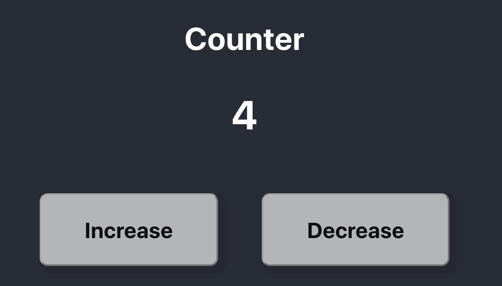
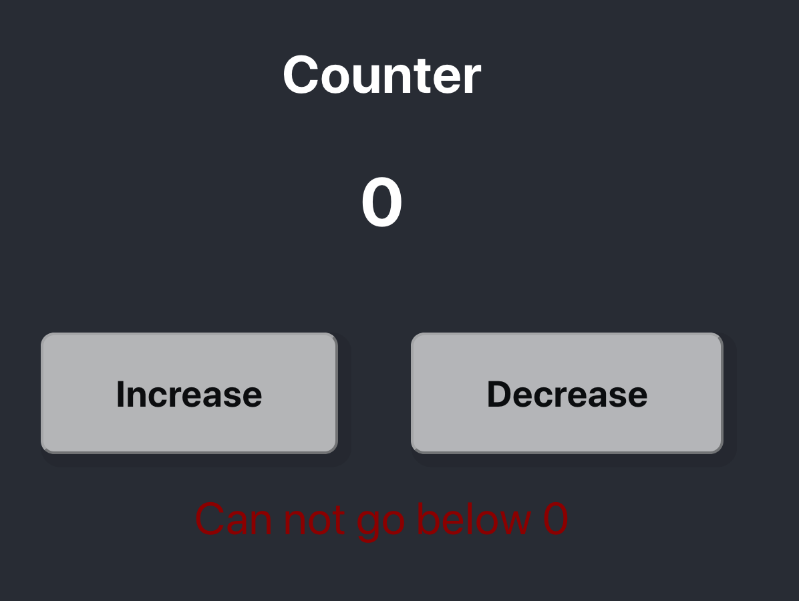

# Counter Test Application

## Counter

This is a simple application to practice testing components in react. It is counter, you can increase the value and decrease the value, but you can not decreas the value below 0. If you try to decrease the value below 0 a warnning message appears.

## Running the Application

In the project directory, you can run:

### `yarn start`

Runs the app in the development mode. 
Open [http://localhost:3000](http://localhost:3000) to view it in the browser.

### `yarn test`

Launches the test runner in the interactive watch mode. 
See the section about [running tests](https://facebook.github.io/create-react-app/docs/running-tests) for more information.

## Testing the Application

All the necessary testing libraries are already installed. Feel free to test all the components by removing the `skip` and filling in the test.

We recommend to first do the testing on the components:

* Button
* Display
* HelperText

And after you finished those tests, add the test for the counter.